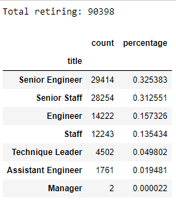
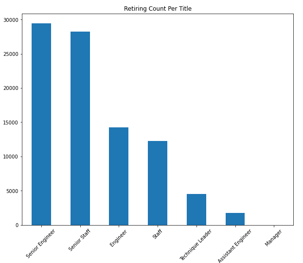
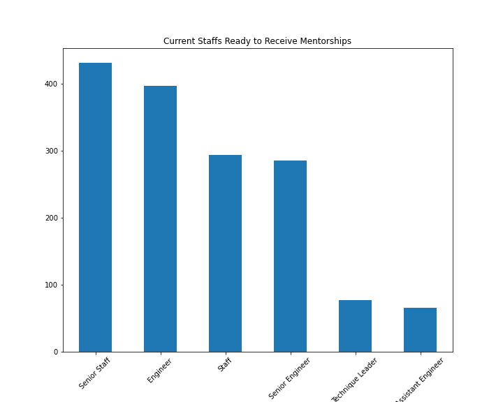

## Pewlett-Hackard-Analysis

# PostgreSQL practice over employees/departments database.
(PostgreSQL 11, pgAdmin 4, quickdatabasediagrams.com)

# Overview of the analysis: 
The porpose of the analysis is to get a big picture on how many of our staffs are retiring and what are their titles. Base on these information, we can arrange employees who are elgible for mentorship program for potential trainnings and protmote them to be new leaders.

# Results: 
## 1. We have about 90k staffs that will be retiring in the next 3 years.

#### Retiring Per Title

## 2. We only have 1.5k staffs that are eliglbe for mentorship program.

#### Current_Staffs Ready_to_Receive_Mentorships

## 3. Our company is facing unblance of seniority. Unless we start to get more younger employees to be ready for next series of trainings and promotions, we wont have enough skills to take on senior roles.

## 4. Development, Production, and Sales departments are the one that lacks next leaders the most.

#### Retiring Employees And Mentors Elgible

